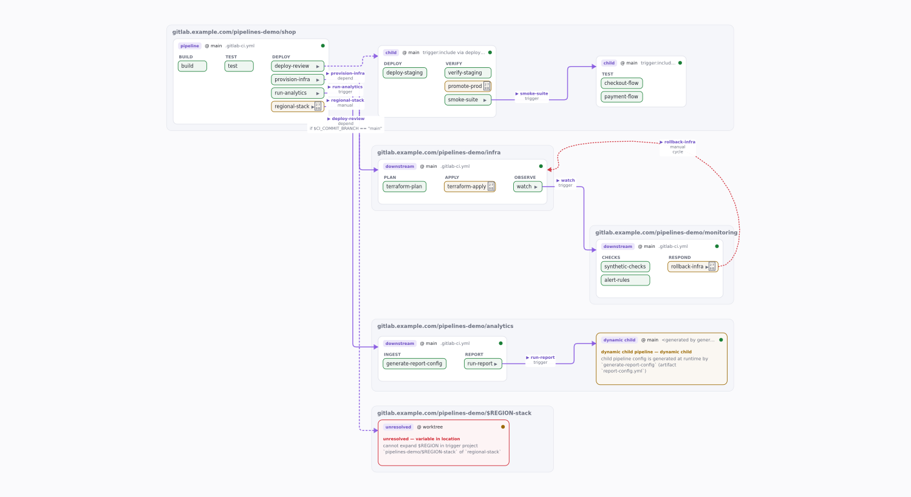
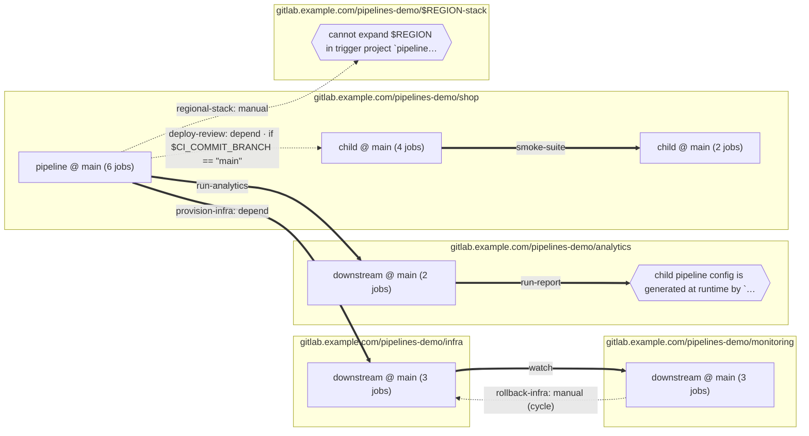
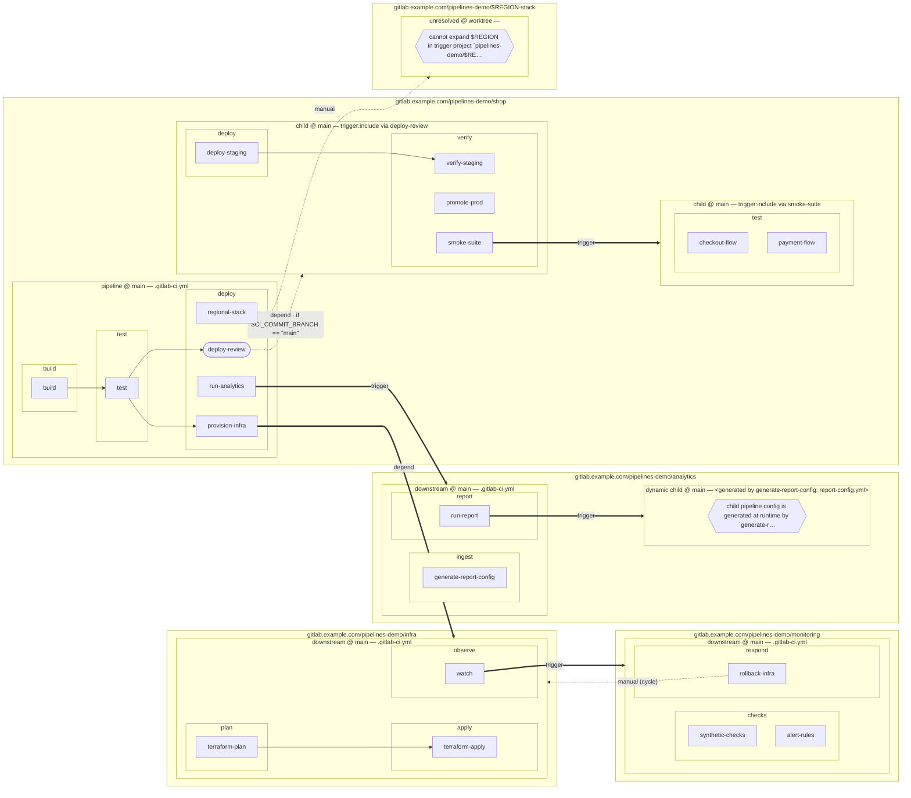

# glpv — GitLab end-to-end pipeline crawler & viewer

`glpv` statically crawls a GitLab CI configuration — every `include`
(local / project / template / component / remote) and every `trigger`
(multi-project and parent-child) — across a folder of locally cloned
projects, and renders the whole flow as one graph: pipelines → stages →
jobs, `needs` edges, trigger edges, include provenance, and conditional
routes. Everything unresolvable (variables in include paths, dynamic child
pipelines, missing clones) stays visible as a first-class node with a reason.

GitLab itself only draws downstream pipelines *after* they have run, and its
Pipeline Editor never follows `trigger` (gitlab-org/gitlab#356817, #217780,
#241722 — open since 2016–2022). No existing tool does the cross-project part
statically; see the prior-art notes in `docs/`.

Source and releases: <https://github.com/me1iissa/glpv> (static Linux and
Windows binaries under Releases; `CHANGELOG.md` has the history, and
versions follow [semantic versioning](docs/VERSIONING.md)).

## What a scan produces

**Live examples** — <https://me1iissa.github.io/glpv/>: the five-project demo
below, and GitLab's own CI (gitlab-org/gitlab and its downstream projects,
~3,000 jobs) scanned against a real diff. Each is one self-contained
`index.html`.

### The interactive map (`index.html`)

[](https://me1iissa.github.io/glpv/demo/)

Project lanes, pipeline cards, stage columns and job pills; `needs` and
trigger edges (dotted when rule-gated, labelled with the condition); a sim bar
that re-evaluates every job as you change the pipeline source, ref, variables
or changed files; a side panel with the rule trace, the invocation chain, "⚡
Enable in simulation" and an outcome explorer; search (`/`), shareable links
and a stack toggle for large fan-outs.

### Mermaid (`mermaid/overview.mmd` and `combined.mmd`)

Rendered by GitLab and GitHub straight from a markdown file — this is the
demo's pipeline overview as emitted:



<details>
<summary>The job-level diagram (<code>combined.mmd</code>)</summary>



</details>

A Graphviz `graph.dot` and the full `graph.json` (every job, rule, trace and
provenance span) are written alongside.

## Status

Progress against the six-milestone plan:

- [x] **M1** — span-preserving YAML layer with Psych (Ruby) semantics,
  single-project resolution (`include:local` + globs, `extends`,
  `!reference`, `default:`, parallel/matrix, needs validation, static rules
  summary), reading any git ref without checkout, JSON / DOT / Mermaid
  output. `glpv resolve` verified byte-for-byte (structurally) against
  GitLab 18.9's server-side `merged_yaml` for real projects.
- [x] **M2** — project index over a clones folder keyed by git remotes,
  `include:project` / `template` / `component` with full context switching,
  `glpv index`, `glpv.toml` overrides.
- [x] **M3 (trigger walk)** — `trigger:` crawling: parent-child children and
  grandchildren (depth cap 2), multi-project chains with a visited set and
  cycle back-edges, dynamic children and unresolved variables as first-class
  nodes; project borders in the DOT and Mermaid output (`combined.mmd`).
  See `demo/` for a five-project playground.
- [x] **M3 (viewer)** — self-contained interactive `index.html` per scan:
  project lanes → pipeline cards → stage columns → job pills, SVG needs/
  trigger edges (dotted when rule-gated, labelled with the gating condition),
  pan/zoom, click-through to rule traces, provenance (file:line opens the
  embedded source) and effective YAML; job/pipeline/stage search (`/`) and
  shareable links (the simulation, selection, edge mode and camera live in
  the URL hash — "copy link"); an optional "stack children" toggle folds runs
  of near-identical child pipelines into one expandable card; a "changed
  files" list in the sim bar (prefilled from a `--diff`/`--changed-file` scan)
  decides `rules:changes` clauses per pipeline instead of a global assumption.
- [x] **M4 (rules engine)** — GitLab-faithful `rules:if` evaluator (Ruby value
  semantics, RE2 regexes, three-valued with `unknown`), `workflow:rules`
  gating, legacy only/except refs, per-job traces in the graph JSON — and a
  JS mirror in the viewer for **live simulation**: change the pipeline
  source, ref/tag or any variable and the whole graph re-evaluates
  (downstream pipelines grey out when their trigger stops firing).
- [x] **M4 (`rules:changes`)** — real diffs instead of a global assumption:
  `--diff <base>` (merge-base diff in every root project) or
  `--changed-file`, Ruby `fnmatch` pattern semantics, `changes:compare_to`,
  `include:rules:changes`, and GitLab's push-event rule (tag, schedule,
  web/api/trigger and downstream pipelines have no diff, so their `changes:`
  always match). The diff is embedded in the graph JSON for the viewer.
- [ ] M4 (rest) — richer scenario sets.
- [x] M5 (oracle) — `glpv check` resolves a project locally and diffs the
  merged configuration and the rules-filtered job list against the server's
  lint API; CI runs it against reference projects, a fresh wasm build and the
  gitlab-org corpus.
- [ ] M5 (API source) — scan without clones through the GitLab REST API.
- [x] M6 (serve) — `glpv serve`: rescan on change, reload pushed to open
  viewers over server-sent events, URL state kept.
- [ ] M6 (rest) — optional ELK layout, docs.

## Usage

```console
$ glpv scan --file path/to/.gitlab-ci.yml -o out/
wrote out/graph.json      # canonical graph (schema_version 1)
wrote out/graph.dot       # Graphviz: dot -Tsvg out/graph.dot > graph.svg
wrote out/mermaid/        # one flowchart per pipeline + overview.mmd

$ glpv scan --file .gitlab-ci.yml --ref main   # a commit instead of the worktree
$ glpv resolve --file .gitlab-ci.yml           # fully merged config, like
                                               # `glab ci config compile` but offline

# Decide rules:changes against a real diff (git diff origin/main...<ref>,
# i.e. since the merge base; untracked files count for a worktree scan),
# or against an explicit changed-file list:
$ glpv scan --file .gitlab-ci.yml --diff origin/main -o out/
$ glpv scan --file .gitlab-ci.yml --changed-file src/main.rs --changed-file docs/x.md

# Cross-project: index a folder of clones and crawl includes + triggers.
$ glpv index --projects ~/projects
$ glpv scan --projects ~/projects --entry acme/api -o out/
$ glpv scan --projects ~/projects --all -o out/   # every project as a root, plus
                                                    # discovery of CI-looking *.yml
                                                    # nothing references (detached)

# The multi-project demo (five interlinked repos):
$ cargo run -p glpv-cli --example build_fixtures -- demo/projects target/glpv-demo
$ glpv scan --projects target/glpv-demo --entry pipelines-demo/shop -o out/

# The stress test: gitlab-org/gitlab itself (blobless shallow clones, ~30 MB total):
$ scripts/fetch-gitlab-corpus.sh corpus/
$ glpv scan --projects corpus --entry gitlab-org/gitlab -o out/
58 pipeline(s), 3167 job(s), 57 trigger edge(s)   # 4 projects, 281 YAML files
# Live: serve the map and rescan on every change under the clones folder (or
# the entry file's repository); open viewers reload and keep their URL state.
$ glpv serve --projects ~/projects --entry acme/api
serving glpv-out at http://127.0.0.1:7070/
watching ~/projects

# The oracle: compare the local resolution with the server (exit 1 on any
# difference). `glab` must be logged in to the host, or use --api-transport
# curl with GLPV_TOKEN.
$ glpv check --file ../api/.gitlab-ci.yml --projects ~/projects
glpv check acme/api @ main  (host gitlab.example.com)
merged configuration: identical (16 top-level keys)
jobs: server would create 11; local expects 11 to run (0 undecided) — identical
```

## Development

```console
$ cargo test --workspace          # unit + fixture snapshot tests
$ cargo clippy --workspace
$ npm ci && npm test              # viewer tests (node 22): evaluator parity + jsdom smoke
```

The HTML viewer renders its board on the GPU (WebGL2 scene + canvas text
overlay, with a Canvas2D fallback) and evaluates rules with the canonical
Rust evaluator compiled to WebAssembly. `scripts/build-wasm.sh` rebuilds
`ui/eval-wasm.b64` from `crates/glpv-wasm`; an empty file makes the viewer
fall back to its mirrored JS evaluator.

The viewer source is two files embedded into one script scope: `ui/eval.js`
(the JS mirror of the rules engine and the simulated variable tables — no DOM,
`require()`-able from node) and `ui/app.js` (the board, panel and simulation
UI). `npm test` first builds the two sample scans (`pretest` runs the fixture
and demo builders through cargo; `GLPV_SKIP_PREPARE=1` reuses existing ones)
and then runs:

- `ui/test/parity.test.mjs` — `tests/parity/expr-cases.json` is the single
  source of truth for `rules:if` semantics, asserted by both the Rust unit
  test `rules::expr::tests::parity_cases` and the JS mirror; then the embedded
  wasm build and the mirror evaluate every job of both samples under a matrix
  of simulations and must agree on outcomes and traces byte for byte. Rebuild
  `ui/eval-wasm.b64` after touching `crates/glpv-core/src/rules/` — the parity
  test fails against a stale build.
- `ui/test/viewer.test.mjs` — a jsdom smoke run of the whole viewer (boot with
  and without wasm, layout sanity, selection → panel, enable-in-simulation,
  outcome explorer). Text metrics and PNG snapshots need the optional `canvas`
  package; `GLPV_SHOTS=1 npm test` writes board screenshots to
  `target/ui-test/shots/`.

Fixture repositories are built deterministically from
`tests/fixtures/projects/*/spec.toml` into `target/glpv-fixtures/`.
The scalar-typing differential test against PyYAML runs automatically when
`python3` with PyYAML is available.

The graph JSON is versioned (`schema_version`, currently 1). Within a
version fields are only ever added, always optional or defaulted (e.g.
`pipelines[].diff`, `rules[].compare_to`), so consumers should ignore keys
they do not know.

GitLab semantics implemented here are documented in `docs/semantics.md`,
with sources. Planned work lives in `docs/ROADMAP.md`; the versioning and
release rules in `docs/VERSIONING.md`. `node ui/test/shot-cli.mjs <index.html>
<out.png>` renders a scan headlessly (the README screenshot is made that way).
