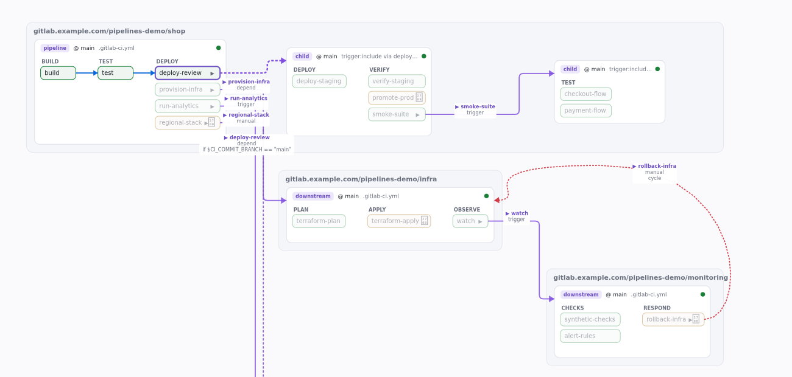

# The viewer

`glpv scan … --format html` writes a single `index.html`: the graph, the
sources, the viewer and a WebAssembly build of the rules engine, all inline —
open it from disk, attach it to a CI job, or serve it as a static page. This
page is a tour of what it shows and what you can do with it. The live
examples on <https://me1iissa.github.io/glpv/> are the same artefact.

## Reading the map

- **Cards are pipelines.** The chip in the corner is the pipeline kind —
  *root*, *child* (`trigger:include`), *multi-project* (`trigger:project`),
  *dynamic child* (a generated configuration that only exists at runtime;
  the card names the job that produces it), *detached* (a CI-looking file no
  trigger reaches) or *unresolved* (with the reason). The header shows the
  project, the ref and the entry file.
- **Columns are stages, pills are jobs.** A pill's colour is the job's
  outcome under the current simulation: *runs*, *manual*, *skipped*,
  *blocked* (the pipeline's `workflow:rules` reject it), *unknown* (something
  the simulation does not pin down) or *delayed*. Decorations: `×N` for
  `parallel`/`matrix` expansions (one pill per base job), `▶` for a bridge,
  `✋` for `when: manual`, `⚠` for `allow_failure` (on non-manual jobs; manual
  jobs are allowed to fail by default).
- **Edges.** Dashed lines inside a card are `needs` (dotted when
  `optional: true`); lines between cards are triggers — dashed when the bridge
  is conditional or manual, red when it closes a cycle. A bridge that fans
  out to many identical children draws one bundle with a `×N` count; the
  *stack* toggle in the top bar collapses those children into a single card
  (click it to expand).
- The counters in the top bar tally the outcomes over the whole map; the
  legend explains the edge styles. Diagnostics from the scan open from the
  chip next to them.

## Moving around

Drag to pan, wheel to zoom, use the minimap or the *fit* button. Press `/`
to search jobs, pipelines and stages (`↑`/`↓`, `Enter` to jump, `Esc` to
clear); matches are ringed on the map while the text stays. The edge-mode
select switches between needs on hover/selection, all needs, and triggers
only.

## The simulation bar

Everything above is computed for one *invocation*: the pipeline source
(`CI_PIPELINE_SOURCE`), the ref and whether it is a tag, extra CI variables,
what to assume for `rules:changes` / `rules:exists` clauses the scan could not
decide, and an explicit changed-files list (prefilled when the scan ran with
`--diff` or `--changed-file`). Change any of it and the whole map is
re-evaluated instantly: the same Rust rules engine runs in the page as
WebAssembly, with a JavaScript mirror as the fallback; the two are held equal
by the parity suite in `ui/test/`.

The variable list offers every variable name the rules read (with the ones
already known to the scan), so a gate can usually be flipped by picking a
name and a value.

## The panel

Click a pill (or pick it from the search) to select it: its lineage — the
jobs it needs, the pipelines it triggers and what triggers it — stays lit
while the rest of the map dims, and the panel opens:

- **Header** — stage, effective `when`, `allow_failure` (including exit-code
  lists), expansion count, and the outcome badge with the reason when the
  pipeline blocks it.
- **How it's invoked** — the chain of pipelines and bridge jobs from the root
  to this job (each hop is a link), then the include chain that contributed
  the job's keys.
- **Rule trace** — every `rules:` clause with its verdict (*matched*, *no
  match*, *unknown*, *not reached*), the variables it read and their state,
  and notes explaining an undecidable clause (`exists:` without a tree,
  `changes:` without a diff, an invalid regex GitLab treats as false, …).
  Legacy `only`/`except` shows the same way, one line per key.
- **Checklist and *Enable in simulation*** — when the job is not running,
  the panel says what would have to be true (a variable value, a source, an
  assumption, a changed file) and offers to apply it to the simulation with
  one click. *Explore all possible outcomes* enumerates the distinct outcomes
  reachable across every pipeline source and the variables the gates read.
- **Variables on this path** — everything the gates read, with *+ set* for
  the ones the simulation leaves open.
- **Needs** — each need is a link to its job. A need the current simulation
  leaves out of the pipeline, or that does not exist, is flagged: GitLab
  rejects such a pipeline unless the need is `optional: true`.
- **Pipeline inputs** — the entry file's `spec:inputs` with the value in
  effect (provided by the trigger, include or `--input`, else the default),
  type, options and description.
- **Trigger** — for a bridge: the child configuration files or the target
  project, and `strategy`.
- **Job variables** — the job's `variables:`, plus the ones a matched rule
  sets under this simulation (forwarded to triggered pipelines with the YAML
  variables).
- **Provenance and effective YAML** — which file set each key, with the
  embedded source, and the job's merged configuration.

## Sharing a view

The simulation, the selected job, the edge mode, the stack toggle and the
camera live in the URL fragment (a base64url-encoded JSON object, versioned;
unknown keys are ignored and garbage falls back to the defaults). *Copy link*
in the top bar puts the URL on the clipboard; opening it restores the exact
view, including on a different window size. Back/forward navigate between
views.

## Live mode

`glpv serve` runs the scan, serves the output and rescans whenever the
configuration changes; open viewers reload over server-sent events and keep
their URL state. See the README for the flags.

## Rendering

The board draws on WebGL2 and falls back to a 2D canvas; text is a separate
layer so labels stay crisp at any zoom. Without any canvas (a text-only
browser, some sandboxes) the panel and the search still work over the data.

For documentation or reviews, `node ui/test/shot-cli.mjs <index.html>
<out.png> [--select <job>] [--hash <#state>]` renders the same page headlessly
(the optional `canvas` npm package is required); the screenshots on this page
were produced that way. It composites the drawing layers only — the panel and
the bars are DOM and do not appear in it.
